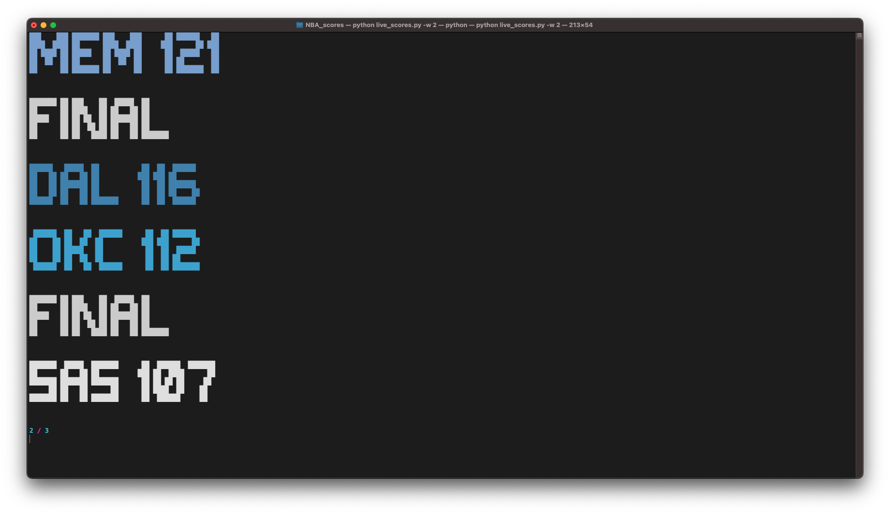

# CLI NBA Live Scores

Simple script to display all the scores of the NBA games in real time on a CLI.
This repo is still under development.


## Instructions

Install the requirements:

```
pip install -r requirements.txt
```

Then, run the following command to get all the configuration options:

```
python live_scores.py -h
```

To quick-start, simply run:

```
python live_scores.py
```
